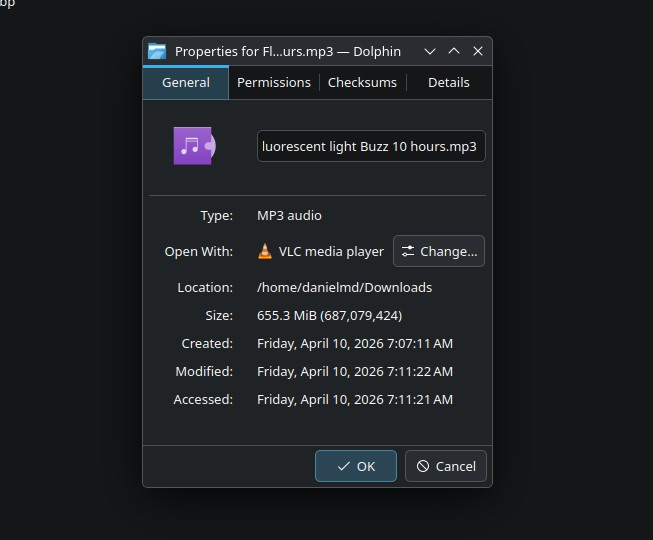

# 📥 YouTube Batch Downloader

A lightweight, transparent YouTube downloader built for people who don't want mystery software on their machine. ~300 lines of Python you can read yourself. No Electron, no auto-updates, no telemetry.


*655MB, 10-hour video. Downloaded without breaking a sweat.*

---

## Why this instead of anything else?

Most GUI downloaders are either bloated Electron apps phoning home, or they silently fail on long videos by trying to buffer too much at once. This one:

- **Streams directly to disk** via yt-dlp — a 10-hour video is handled the same as a 10-minute one
- **No network calls except to YouTube** — it's a thin UI wrapper over yt-dlp, nothing else
- **You can audit the entire codebase in 5 minutes** — if you're paranoid about what's running on your machine, this is for you
- **Apple Music metadata out of the box** — embeds title, artist, album art into m4a files automatically

---

## Features

- Batch download — paste multiple URLs, one per line
- Formats: `m4a (Apple Music)`, `mp3`, `mp4`
- Quality selection per format
- Embedded metadata + thumbnail (album art) for audio files
- Progress bar with per-item speed display
- Cancel mid-batch

---

## Requirements

### Python packages
```
pip install pyqt5 yt-dlp
```

### System dependencies
These need to be installed and available in your `PATH`:

| Dependency | Purpose | Install |
|---|---|---|
| **FFmpeg** | Audio extraction, video merging, encoding | `sudo apt install ffmpeg` / `sudo dnf install ffmpeg` |
| **AtomicParsley** | Embedding thumbnails into m4a files | `sudo apt install atomicparsley` / `sudo dnf install AtomicParsley` |

> ⚠️ If AtomicParsley is missing, m4a thumbnail embedding will silently fail. The download itself will still work.

### Full requirements at a glance
```
Python 3.8+
PyQt5
yt-dlp
ffmpeg        (system)
AtomicParsley (system)
```

---

## Usage

```bash
python youtube_downloader.py
```

1. Paste one or more YouTube URLs (one per line)
2. Choose format and quality
3. Pick a save folder
4. Hit **Start Batch**

---

## Notes

- `noplaylist` is enabled by default — paste individual video URLs, not playlist links
- m4a quality is "best available" — yt-dlp pulls the highest quality audio stream without re-encoding when possible
- mp3 quality options: 320k / 192k / 128k

---

## License

Do whatever you want with it.
